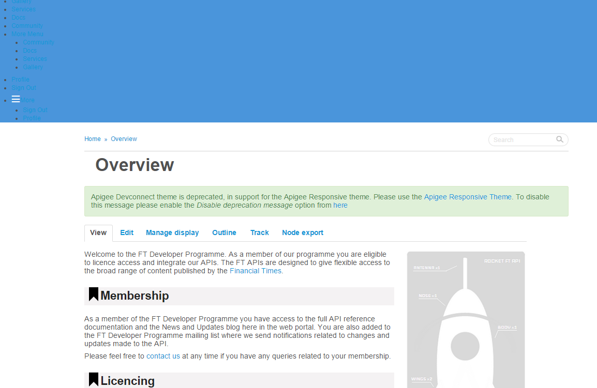
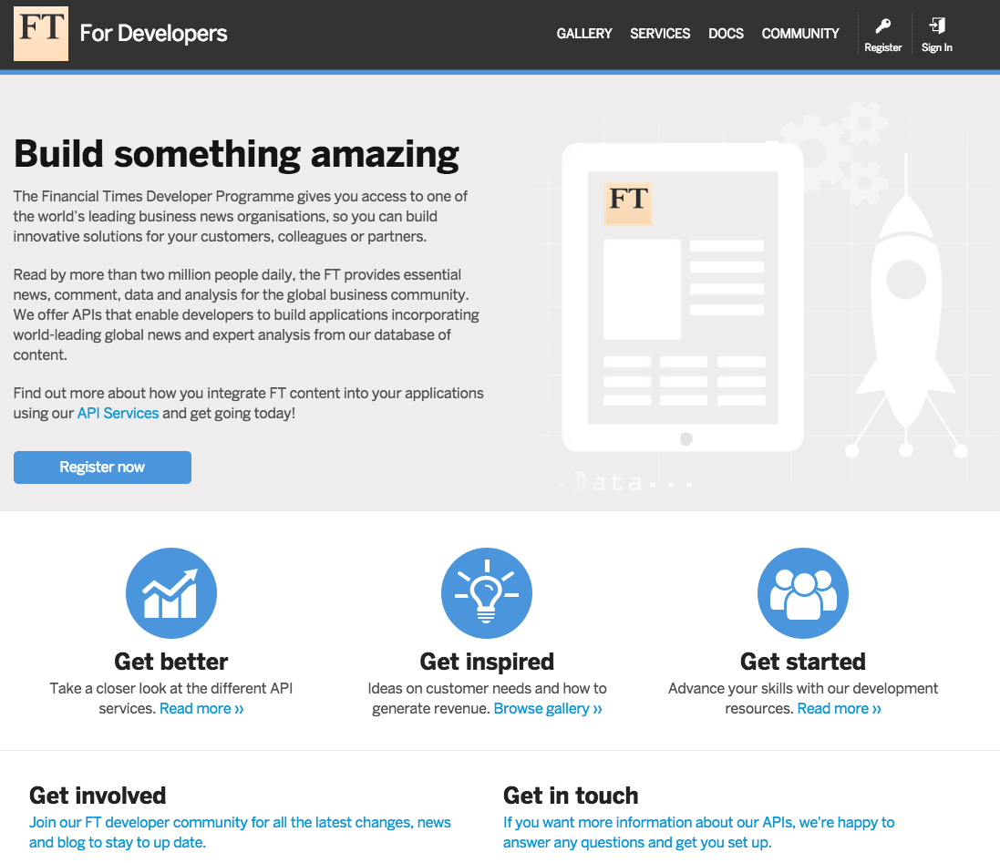

# 2014-12-10 - Developer portal layout broken

- Issue raised at 12:12, heavily impacting the user experience on <http://developer.ft.com>
- Fix communicated at 12:16
- Fully fixed at 13:43

12:12: Geoff Knott <geoff.knott@ft.com> sends an email around to ask if there has been an issue with the Origami build service, with this screenshot:

The issue was on <http://developer.ft.com>, where this CSS would give a "400 Bad Request" error:

https://build.origami.ft.com/bundles/css?modules=o-grid@^2.1.5,o-ft-icons@^2.2.2,o-ft-header@2.5.5,o-colors@2.3.17,o-ft-typography@1.12.2,o-ft-buttons@1.5.4,o-fonts@1.4.1

Body of the request:

	/*
	Cannot complete build: Unable to find suitable version for o-colors

	o-colors 2.3.17 required by __MAIN__ undefined
	o-colors ^2.3.15 required by o-ft-header 2.5.5
	o-colors ^2.2.20 required by o-hierarchical-nav ^0.2.8
	o-colors ^2.3.0 required by o-ft-typography 1.12.2
	o-colors ^2.4.3 required by o-ft-buttons ~1.5.2
	*/

The the Origami team answered within minutes with a fix:

12:16: Kaelig Deloumeau <kaelig.deloumeau@ft.com> sends a fix

> There is a cross dependency issue with the modules that are being required.  
> Can you please the URL pointing to the build service to this one:
https://build.origami.ft.com/bundles/css?modules=o-grid@^2.1.5,o-ft-icons@^2.2.2,o-ft-header@2.5.14,o-colors@2.4.3,o-ft-typography@1.12.2,o-ft-buttons@1.5.4,o-fonts@1.4.1

12:25: Kaelig Deloumeau <kaelig.deloumeau@ft.com> sends a quick explanation and an update on what the Origami team will do about it:

> It seems the inconvenience was caused before we’ve updated the dependencies on some modules recently, but the modules that your product were requiring had clashing interests.  
> We’re going to widen the dependency range so that this doesn’t happen again.  

13:01: Kaelig Deloumeau <kaelig.deloumeau@ft.com> sends an explanation:

> I am happy to announce that we’ve rolled out fixes to the dependency ranges, but the URL pointing to the build service in developer.ft.com will still return an error (you can use the URL in my previous email).
> 
> We’d like to advise against targeting specific versions of modules and caret ranges at the same time, as it increases the chance of running into such dependency issues.
> 
> In a nutshell, you should request either:
> - a mix of specific versions @1.2.3 with tilde semver ranges @~1.2.x
> - only caret semver ranges @^1.x.x
> 
> This is because a minor release might introduce changes that break the dependency tree.

13:05: Kaelig Deloumeau <kaelig.deloumeau@ft.com> goes to the impacted product team, speak to Ben Bernardo and Martin Garton to ask who can solve that problem in production.

13:15: Ben Bernardo <ben.bernardo@ft.com> asks if there is some dev time from Christina to solve this problem

13:43: Ben Bernardo <ben.bernardo@ft.com>:

> Hi Geoff and Kaelig(+All),  
> Please be advised that the fix has been deployed to Prod successfully.  
> Special thanks to Cristina for a job well done!

Following this, Alberto Elias <alberto.elias@ft.com> did a series of tweaks to allow for broader dependency version tolerance in a few modules:

- https://github.com/Financial-Times/o-ft-header/releases/tag/2.5.15
- https://github.com/Financial-Times/o-ft-typography/releases/tag/1.15.5

Following investigation, the Origami team thinks it was a build service bug, and opened a JIRA ticket [ORIGBUILD-26](https://jira.ft.com/browse/ORIGBUILD-26?jql=project%20%3D%20ORIGBUILD) where further discussion should happen.
